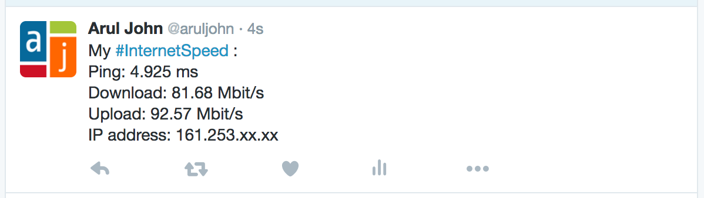

# Tweet your Internet Speed

1. First, create a Twitter application. Go to https://apps.twitter.com/ and click on **Create New App**.

2. After creating the application, click on the tab that says **Keys and Access Tokens**. Generate the **Consumer Key** and **Secret**. Also, generate the **Access Token** and **Token Secret**. Do not give these values to anyone.

3. Click on the tab **Permissions** and set the access to **Read and Write**.

4. Copy the script `internetspeed.py` to a directory of your choice. Mine is copied to `/usr/local/bin/internetspeed.py`.

5. Download the speedtest.net command line script [speedtest.py](https://github.com/sivel/speedtest-cli/blob/master/speedtest.py). Save it in a directory of your choice. I copied mine to `/usr/local/bin/speedtest.py`.

6. Edit `internetspeed.py` and replace the four values (**consumer_key**, **consumer_secret**, **access_token**, **access_token_secret**) with the values in the Twitter application you just created. Also, replace the **script_path** value with the full path to the `speedtest.py` script.

6. Run the script:

    `python /usr/local/bin/internetspeed.py`

7. To set a cronjob to run this script and tweet your Internet speed every 3 hours, you can use this line:

```
# Run every 3 hours
5 0-23/3 * * * /usr/bin/python /usr/local/bin/internetspeed.py >> /tmp/speedtest.log
```

## Screenshot


